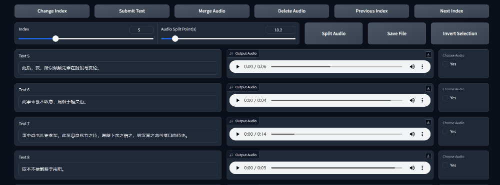

# SubFix
`SubFix` is a web tool designed for easily editing and modifying audio subtitles. Users can see changes in real-time and conveniently **merge, split, delete, and edit subtitles** of audios, immediately knowing the effects of the modifications.

[中文版本](README_zh.md)

## Installation

Follow the steps below for quick and easy installation. It is recommended to use a `Linux` environment. If using `Windows`, you will need to manually configure the `ffmpeg` environment variable.

### Installing Dependencies

Ensure the installed version of `Python` is above `3.8`, then execute the following command. If you do not need to use automatic labeling of audio, there is no need to install the `Modelscope` module.

```bash
pip install librosa gradio numpy soundfile
```

## Launch SubFix to View Dataset

`SubFix` supports 2 formats, which are `.json` and `.list`.

In the `.list` format, each line of data is similar to `"{wav_path}|{speaker_name}|{language}|{text}"`.

For example, if you already have a `demo.list` file and the corresponding audio has been placed in the correct path, execute the following command to launch the `SubFix` UI interface:

```bash
python subfix_webui.py --load_list demo.list
# or
python subfix_webui.py --load_json demo.json
```

### Quick Viewing and Listening to Audio

You can click the `Previous Index` and `Next Index` buttons to switch lists, or drag the `slider` and click `Change Index` for quick positioning in the list.


### Modifying Text

You can directly modify the text and click the `Submit Text` button to save the changes.


### Merging

Select the audios you want to merge, set the `merge interval`, and then click the `merge` button to merge the audio.


### Splitting Audio

Select the audio to be split, set the `split point`, and then click the `split` button to proceed. Note that only one audio can be split at a time, and the text needs to be adjusted again after splitting.


### Deleting

Select the audio to be deleted and click the `button` to delete. The delete operation will be temporarily stored in memory. To save it to a file, click the save button or execute another command.



## Modelscope Installation (Optional)

To execute `subfix_create_dataset.py` for automatic annotation of original audios, execute the following command under `Linux`, and it is best to ensure that the `Python` version is `3.8/3.9`. Here is a way to use `conda` to ensure the `Python` environment is version `3.8`.

```bash
conda create -n modelscope python=3.8
conda activate modelscope
```

Then, install `ffmpeg`, install the `modelscope` module, and upgrade the `protobuf` module:

```bash
sudo apt install ffmpeg

pip install "modelscope[audio]" -f https://modelscope.oss-cn-beijing.aliyuncs.com/releases/repo.html
pip install --upgrade protobuf
pip install librosa gradio numpy soundfile
```

### Auto-annotate Audio and Create Dataset

By default, place audio files in the `origin` folder. For a `sam` audio file `abc.wav`, its file path can be structured like `./origin/sam/abc.wav`. Execute the following command:

```bash
python subfix_create_dataset.py --source_dir origin --output demo.list
```

This command will create a `dataset` directory and store the paths and subtitles of all transcribed audio files in the `demo.list` file.

## Format Conversion

The two formats `.list` and `.json` can be converted to each other. Use the following commands to convert files:

```bash
python subfix_to_json.py --source_file demo.list --target_file demo.json
python subfix_to_list.py --source_file demo.json --target_file demo.list
```

## References

- [anyvoiceai/MassTTS](https://github.com/anyvoiceai/MassTTS)
- [fishaudio/Bert-VITS2](https://github.com/fishaudio/Bert-VITS2)